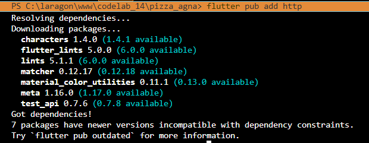
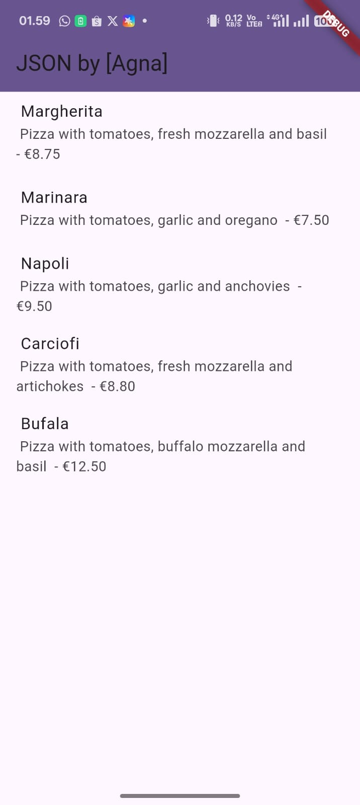
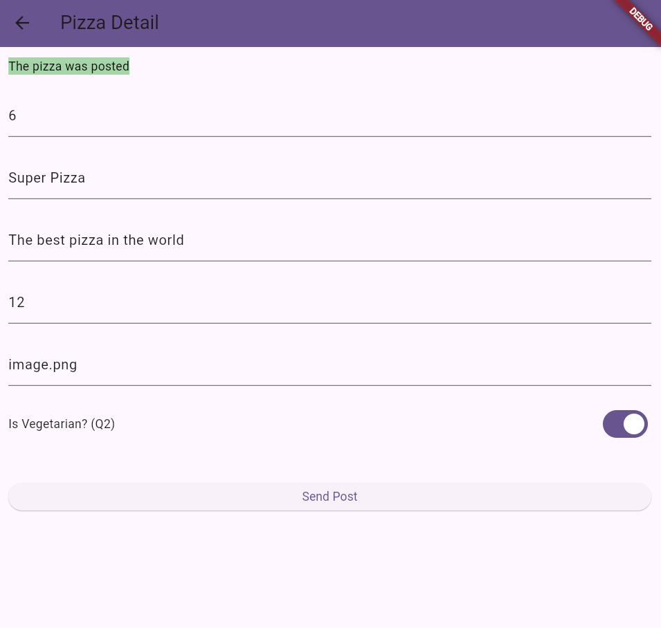

# codelab_14

## Practical 1: Creating a Mock API service

### Step 1
1. Sign up for the Mock Lab service at https://app.wiremock.cloud/ and register on the site, create your username and password.


### Step 2
2. Log in to the service, go to "Example Mock API," and click on the Stubs section of the example API. Then, click on the first entry—Get a JSON resource. You should see a screen similar to the following:


### Step 3
Click the New button. For the Name, type Pizza List, leave GET as the verb, and in the text box next to the GET verb, type /pizzalist. Then, in the Response section, for status 200, select JSON as the format and paste the JSON content available at https://bit.ly/pizzalist .


### Step 4
Click the Save button at the bottom of the page to save the stub. This completes the setup for the mock backend service.


### Step 5
Back in your Flutter project, add the http dependency by typing in your Terminal:
flutter pub add http



### Step 6
In the lib folder in your project, add a new file named httphelper.dart.


### Step 7
In the httphelper.dart file, add the following code:
```dart:
import 'dart:io'; 
import 'package:http/http.dart' as http; 
import 'dart:convert'; 
import 'pizza.dart'; 

class HttpHelper {
  final String authority = '02z2g.mocklab.io';
  final String path = 'pizzalist';
  Future<List<Pizza>> getPizzaList() async {
    final Uri url = Uri.https(authority, path);
    final http.Response result = await http.get(url);
    if (result.statusCode == HttpStatus.ok) {
      final jsonResponse = json.decode(result.body);
      //provide a type argument to the map method to avoid type 
      //error
      List<Pizza> pizzas =
          jsonResponse.map<Pizza>((i) => 
            Pizza.fromJson(i)).toList();
      return pizzas;
    } else {
      return [];
    }
  }
}
```

### Step 8
In the main.dart file, in the _MyHomePageState class, add a method named callPizzas. This returns a Future of a List of Pizza objects by calling the getPizzaList method of the HttpHelper class, as follows:
```dart:
Future<List<Pizza>> callPizzas() async {
  HttpHelper helper = HttpHelper(); 
  List<Pizza> pizzas = await helper.getPizzaList(); 
  return pizzas; 
} 
```

### Step 9
In the build method of the _MyHomePageState class, in the Scaffold body, add a FutureBuilder that builds a ListView from a ListTile widget containing Pizza objects:
```dart:
Widget build(BuildContext context) { 
    return Scaffold(
      appBar: AppBar(title: const Text('JSON')),
      body: FutureBuilder(
          future: callPizzas(),
          builder: (BuildContext context, AsyncSnapshot<List<Pizza>> 
snapshot) {
          if (snapshot.hasError) {
            return const Text('Something went wrong');
          }
          if (!snapshot.hasData) {
            return const CircularProgressIndicator();
          }
            return ListView.builder(
                itemCount: (snapshot.data == null) ? 0 : snapshot.
data!.length,
                itemBuilder: (BuildContext context, int position) {
                  return ListTile(
                    title: Text(snapshot.data![position].pizzaName),
                    subtitle: Text(snapshot.data![position].
description +
                        ' - € ' +
                        snapshot.data![position].price.toString()),
                  );
                });
          }),
    );  
}
```

### Step 10
Run the application. You should see a screen similar to the following:



The image is a screenshot of a list of items fetched over HTTP, showing a ListView with the pizza name and its description.

- Question 1
Add your nickname to titlethe app as an identity for your work.
Change the application theme color according to your preference.
Capture the results of your application, then enter it into the report in the README and commit the results of the answer to Question 1 with the message "W14: Answer to Question 1"


We currently only have one method that uses the HttpHelper class. As our application grows, we may need to call HttpHelper multiple times in different parts of the application, and it would be a waste of resources to create multiple instances of the class each time we need to use a method from that class.

One way to avoid this is to use a factory constructor and the singleton pattern: this ensures you only instantiate a class once. This is useful whenever only one object is needed in your application and when you need to access resources you want to share across applications.

In the file httphelper.dart, add the following code to the class HttpHelper, just below the declaration:
```dart:
static final HttpHelper _httpHelper = HttpHelper._internal();
HttpHelper._internal();
factory HttpHelper() {
    return _httpHelper;
}
```
There are several patterns in Dart and Flutter that allow you to share services and business logic across your apps, and the singleton pattern is just one of them. Other options include Dependency Injection, Inherited Widgets, and Provider and Service Locators. There's an interesting article about the different options available in Flutter at http://bit.ly/flutter_DI

## Practical 2: Sending Data to Web Service (POST)

### Step 1
Log in to the Mock Lab service at https://app.wiremock.cloud/ and click on the Stubs section of the example API. Then, create a new stub.


### Step 2
Complete the request as follows:
Name: Post Pizza
Verb: POST
Address: /pizza
Status: 201
Body Type: json
Body: {"message": "The pizza was posted"}


Screenshot of the WireMock Post Pizza stub, showing the stub configuration with name, POST verb, path, status 201, and JSON response body.

### Step 3
Press the Save button.


### Step 4
In the Flutter project, in the httphelper.dart file, in the HttpHelper class, create a new method named postPizza, as follows:
```dart:
Future<String> postPizza(Pizza pizza) async {
  const postPath = '/pizza';
  String post = json.encode(pizza.toJson());
  Uri url = Uri.https(authority, postPath);
  http.Response r = await http.post(
    url,
    body: post,
  );
  return r.body;
}
```

### Step 5
In the project, create a new file named pizza_detail.dart.

### Step 6
At the top of the new file, add the necessary imports:
```dart:
import 'package:flutter/material.dart';
import 'pizza.dart';
import 'httphelper.dart';
```

### Step 7
Create a StatefulWidget named PizzaDetailScreen:
```dart:
class PizzaDetailScreen extends StatefulWidget {
  const PizzaDetailScreen({super.key});
  @override
  State<PizzaDetailScreen> createState() => _PizzaDetailScreenState();
}

class _PizzaDetailScreenState extends State<PizzaDetailScreen> {
  @override
  Widget build(BuildContext context) {
    return Placeholder();
  }
}
```

### Step 8
At the top of the _PizzaDetailScreenState class, add five TextEditingControllers. These will contain the data for the Pizza object that will be posted later. Also, add a String that will contain the result of the POST request:
```dart:
final TextEditingController txtId = TextEditingController();
final TextEditingController txtName = TextEditingController();
final TextEditingController txtDescription = TextEditingController();
final TextEditingController txtPrice = TextEditingController();
final TextEditingController txtImageUrl = TextEditingController();
String operationResult = '';
```

### Step 9
Override the dispose() method to dispose of the controller:
```dart:
@override
void dispose() {
  txtId.dispose();
  txtName.dispose();
  txtDescription.dispose();
  txtPrice.dispose();
  txtImageUrl.dispose();
  super.dispose();
}
```

### 10 Step
In the build() method of the class, return a Scaffold, whose AppBar contains the Text "Pizza Detail" and whose body contains Padding and a SingleChildScrollView containing Columns:
```dart:
return Scaffold(
  appBar: AppBar(
    title: const Text('Pizza Detail'),
  ),
  body: Padding(
      padding: const EdgeInsets.all(12),
      child: SingleChildScrollView(
        child: Column(children: []),
      )));
```

### Step 11
For the Column's children property, add some Text fields that will contain the post results, five TextFields, each bound to their own TextEditingController, and an ElevatedButton to complete the POST action (the postPizza method will be created next). Also, add a SizedBox to keep the widgets spaced on the screen:
Text(
  operationResult,
  style: TextStyle(
      backgroundColor: Colors.green[200],
      color: Colors.black),
),
const SizedBox(
  height: 24,
),
TextField(
  controller: txtId,
  decoration: const InputDecoration(hintText: 'Insert ID'),
),
const SizedBox(
  height: 24,
),
TextField(
  controller: txtName,
  decoration: const InputDecoration(hintText: 'Insert Pizza Name'),
),
const SizedBox(
  height: 24,
),
TextField(
  controller: txtDescription,
  decoration: const InputDecoration(hintText: 'Insert Description'),
),
const SizedBox(
  height: 24,
),
TextField(
  controller: txtPrice,
  decoration: const InputDecoration(hintText: 'Insert Price'),
),
const SizedBox(
  height: 24,
),
TextField(
  controller: txtImageUrl,
  decoration: const InputDecoration(hintText: 'Insert Image Url'),
),
const SizedBox(
  height: 48,
),
ElevatedButton(
    child: const Text('Send Post'),
    onPressed: () {
      postPizza();
    })           

### Step 12
At the bottom of the _PizzaDetailScreenState class, add a postPizza method:
```dart:
Future postPizza() async {
  HttpHelper helper = HttpHelper();
  Pizza pizza = Pizza();
  pizza.id = int.tryParse(txtId.text);
  pizza.pizzaName = txtName.text;
  pizza.description = txtDescription.text;
  pizza.price = double.tryParse(txtPrice.text);
  pizza.imageUrl = txtImageUrl.text;
  String result = await helper.postPizza(pizza);
  setState(() {
    operationResult = result;
  });
}
```

### Step 13
In the main.dart file, import the pizza_detail.dart file
In the Scaffold of the build() method of the _MyHomePageState class, add a FloatingActionButton that will navigate to the PizzaDetail route:
```dart:
floatingActionButton: FloatingActionButton(
  child: const Icon(Icons.add),
  onPressed: () {
    Navigator.push(
      context,
      MaterialPageRoute(
          builder: (context) => const PizzaDetailScreen()),
    );
  }),
```

### Step 15
Run the app. On the main screen, press the FloatingActionButton to navigate to the PizzaDetail route.

### Step 16
Add the pizza details in the text field and press the Send Post button. You should see a successful result, as shown in the following image:



Screenshot of the Pizza Detail screen with the success message "The pizza was posted" after pressing the Send Post button.

Web services (specifically, RESTful web services) work with verbs. There are four main actions (or verbs) that you'll typically use when data is involved: GET, POST, PUT, and DELETE.

In this practical 2, we use POST, which is a verb conventionally used when an application asks a web server to insert a new piece of data.

This is why we need to instruct the mock web service to accept POSTs at the /pizza address first, so it can try sending some data to it and make it respond with a success message.

After creating the POST stub in Wiremock, we create the postPizza method to actually make the call to the server. Since this takes a JSON string, we use the json.encode method to convert the Map to JSON.

- Question 2
Add new fields in JSON or POST to Wiremock!
Capture your application results as a GIF in the README and commit the answer to Question 2 with the message "W14: Answer to Question 2"


